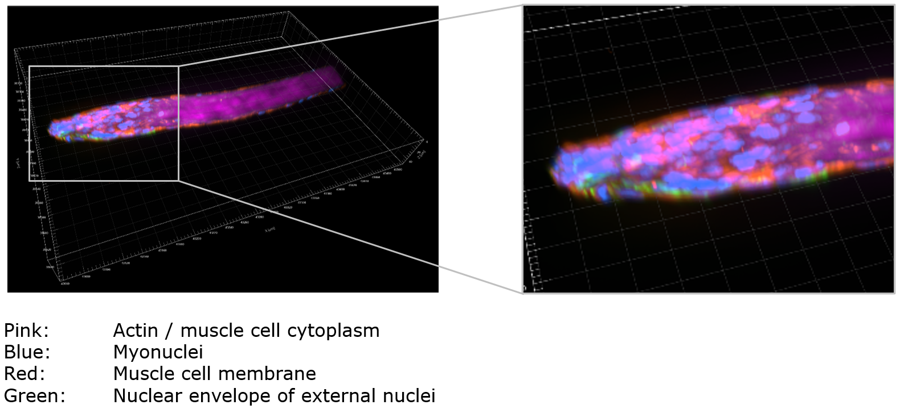
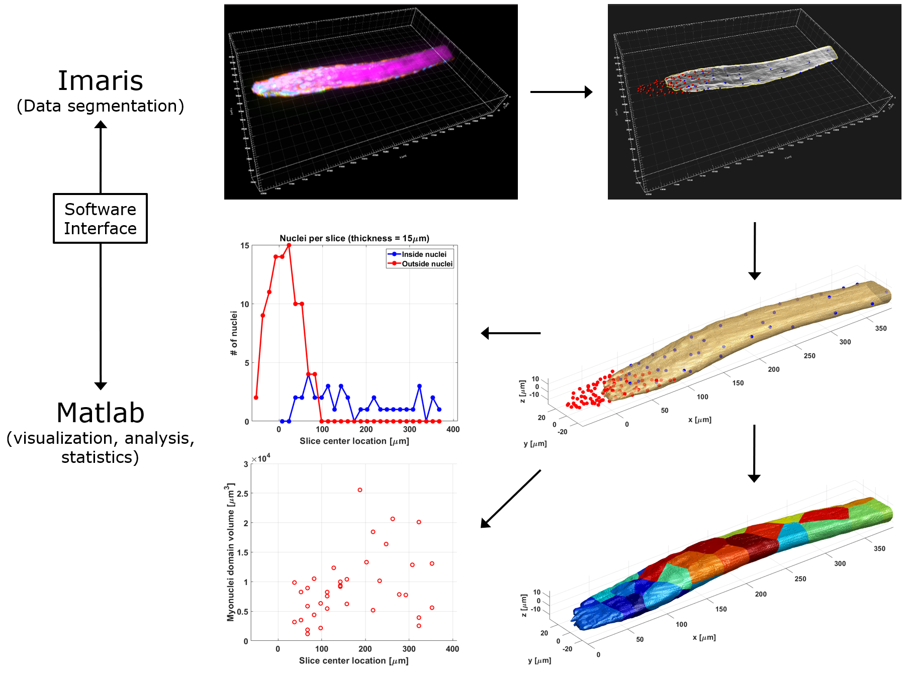

#  Automated-muscle-fiber-analysis
### Matlab (The Mathworks) plugin for Imaris (Oxford Instruments), developed within the scope of the collaboration between Christian Høgsbjerg and Abigail Mackey, Bispebjerg Hospital, Institute of Sports Medicine Copenhagen. 

###The goal of this collaboration was to analyze various measures like the myonuclei density along the fiber or the size of the myonuclei domain (MND) from human muscle fiber images. The data segmentation was done manually in Imaris (Oxford Instruments), and the subsequential analysis and results visualization automatically in Matlab (The Mathworks).

### Example image data. The colors indicate muscle cell cytoplasm (pink), the myonuclei (blue), the muscle cell membrane (red) and the nuclear envelope for external nuclei (green):

### Analysis workflow demo:

### Function description
function muscleFibreAnalysis(aImarisApplicationID)

Input:
aImarisApplicationID        Imaris server object, representing the
                            currently active scene in Imaris. 
                            The ID is provided by Imaris when calling 
                            the plugin.

muscleFibreAnalysis is a Matlab plugin for the Imaris software package 
  (https://imaris.oxinst.com/open/). It queries the current scene for an
  Imaris surface object (muscle fiber) and a set of Imaris spots objects
  (myonuclei), imports the data to Matlab and performs a series of 
  measurements:

1. Inside nuclei NN [um]
   Nearest neighbor (NN) distance between all myonuclei labeled as 
   being located inside the fiber
2. Outside nuclei NN [um] 
   NN distance between all nuclei labeled as being located outside 
   the fiber
3. Outside to Inside nuclei NN [um]
   Inside nuclei NN distance for all outside nuclei
4. Outside to fiber surface distance [um]
   Shortest distance to the fiber surface for all outside nuclei
5. Myonuclei domain surface area (MNDS) [um^2]
   The area of the fiber surface, that is part of a nucleus' domain.
   Areas touching the data domain boundary are discarded.
6. Myonuclei domain volume (MNDV) [um^3]
   The volume of the fiber, that is part of a nucleus' domain. Volumes
   touching the data domain boundary are discarded.
7. The number of outside and inside nuclei per unit slice [count],
   measured with respect to the longitudinal axis of the fiber, 
   starting from the tip of the fiber. The slice thickness can be set 
   by the user. Data slices touching the data domain boundary are 
   discarded. 
8. Inside nuclei density [count/um^3] 
   Number of inside nuclei per slice volume.

All analysis results are provided as Matlab figures and exported as PNG 
image files and Excel sheets. In addition, the following figures are 
generated and exported:

1. The fiber surface and the inside and outside nuclei
2. The MNDS domains in different colors
3. The MNDS domains, semi-transparent, and the MNDV sizes represented
   as spheres around the nuclei
4. A 3D image stack with the MNDVs in different greyvalues

IMPORTANT: Nuclei inside the fiber should be labeled 'Class A' and 
nuclei outside the fiber should be labeled 'Class B' in Imaris, as the
plugin cannot distinguish between the two otherwise.

Version: 1.0
Author: Martin Baiker-Soerensen; DBI-IACF; Copenhagen University; 03/23
Update: Martin Baiker-Soerensen; DBI-IACF; Copenhagen University; 04/23
Status: TESTING (Matlab version: 2022b, Imaris version: 10.0.0)

Note that the code related to the Imaris bridge communication was in part
developed by Aaron Ponti in 2012, as part of an Imaris-Matlab bridge
workshop: http://www.scs2.net/next/files/courses/iic/ImarisXTCourse.pdf

Note that the code for aligning the sample to the longitudinal axis is 
based on: 'Kin Sung Chan (2023). Align/Rotate Point Cloud Along Z 
direction based on PCA, MATLAB Central File Exchange. April 21, 2023.'