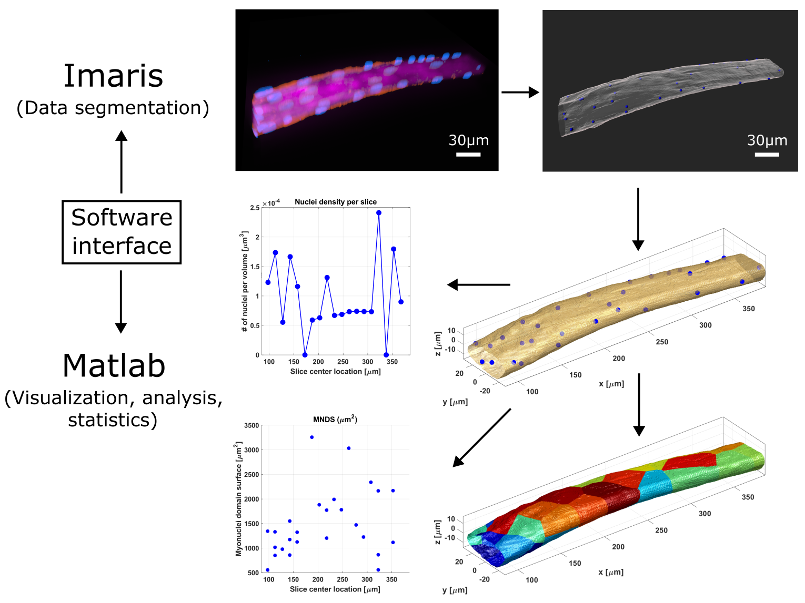

#  Automated-muscle-fiber-analysis
### Matlab (The Mathworks) plugin for Imaris (Oxford Instruments).
Within the scope of a collaboration with researchers Christian Høgsbjerg and Abigail Mackey from the Institute of Sports Medicine Copenhagen, Bispebjerg Hospital, we developed a way to estimate the myonucleus density along human muscle fibers and to characterize the myonuclei domains (MND). The data segmentation was performed semi-automatically with Imaris followed by manual curation. The target measurements and results visualization were performed automatically from a Imaris XT Matlab module developed specifically for that purpose by DBI-INFRA Image Analysis Core Facility. 

### *Top row: Datasets of stained muscle fibers (pink: cell cytoplasm, blue: myonuclei and red: muscle cell membrane) were segmented semi-automatically in Imaris (Oxford Instruments) to extract the surface of the cytoplasm (grey, semi-transparent surface) as well as the centers of the nuclei (blue spheres). Middle and bottom row: Using an Imaris-Matlab bridge, the surface and the nuclei centers were imported into Matlab, to determine various measures like the nucleus density along the fiber or the myonuclear domain surface (MNDS). In addition, different ways of results visualization were implemented, e.g. the MNDS areas belonging to different nuclei.*

### Function description
function muscleFibreAnalysis(aImarisApplicationID)

Input:
aImarisApplicationID        Imaris server object, representing the
                            currently active scene in Imaris. 
                            The ID is provided by Imaris when calling 
                            the plugin.

muscleFibreAnalysis is a Matlab plugin for the Imaris software package 
  (https://imaris.oxinst.com/open/). It queries the current scene for an
  Imaris surface object (muscle fiber) and a set of Imaris spots objects
  (myonuclei), imports the data to Matlab and performs a series of 
  measurements:

1. Inside nuclei NN [um]
   Nearest neighbor (NN) distance between all myonuclei labeled as 
   being located inside the fiber
2. Outside nuclei NN [um] 
   NN distance between all nuclei labeled as being located outside 
   the fiber
3. Outside to Inside nuclei NN [um]
   Inside nuclei NN distance for all outside nuclei
4. Outside to fiber surface distance [um]
   Shortest distance to the fiber surface for all outside nuclei
5. Myonuclei domain surface area (MNDS) [um^2]
   The area of the fiber surface, that is part of a nucleus' domain.
   Areas touching the data domain boundary are discarded.
6. Myonuclei domain volume (MNDV) [um^3]
   The volume of the fiber, that is part of a nucleus' domain. Volumes
   touching the data domain boundary are discarded.
7. The number of outside and inside nuclei per unit slice [count],
   measured with respect to the longitudinal axis of the fiber, 
   starting from the tip of the fiber. The slice thickness can be set 
   by the user. Data slices touching the data domain boundary are 
   discarded. 
8. Inside nuclei density [count/um^3] 
   Number of inside nuclei per slice volume.

IMPORTANT: Nuclei inside the fiber should be labeled 'Class A' and 
nuclei outside the fiber should be labeled 'Class B' in Imaris, as the
plugin cannot distinguish between the two otherwise. In addition, the 
scene should either include only one surface object, or the relevant 
surface object should be the first in the list as Matlab simply takes 
the first surface object in the scene it can find.

All analysis results are provided as Matlab figures and exported as PNG 
image files and Excel sheets. In addition, the following figures are 
generated and exported:

1. The fiber surface and the inside and outside nuclei
2. The MNDS domains in different colors
3. The MNDS domains, semi-transparent, and the MNDV sizes represented
   as spheres around the nuclei
4. A 3D image stack with the MNDVs in different greyvalues

Version: 1.0
Author: Martin Baiker-Soerensen; DBI-IACF; Copenhagen University; 03/23
Update: Martin Baiker-Soerensen; DBI-IACF; Copenhagen University; 04/23
Status: TESTING (Matlab version: 2022b, Imaris version: 10.0.0)

Note that the code related to the Imaris bridge communication was in part
developed by Aaron Ponti in 2012, as part of an Imaris-Matlab bridge
workshop: http://www.scs2.net/next/files/courses/iic/ImarisXTCourse.pdf

Note that the code for aligning the sample to the longitudinal axis is 
based on: 'Kin Sung Chan (2023). Align/Rotate Point Cloud Along Z 
direction based on PCA, MATLAB Central File Exchange. April 21, 2023.'

### Plugin usage
For Matlab plugins to be available in Imaris, the XTension module has to be 
purchased (allowing Matlab, Python and ImageJ/Fiji plugins to be added).
There are two alternative ways to use a Matlab plugin in Imaris, using Matlab
scripts (which will then be compiled on-the-fly when running them) or compiled 
executable file. For users who have administrator rights, and therefore can 
start up Imaris as admin, can choose which approach to use. 
Regular users are limited to using executables.

Scripts and executables have to be placed in the Xtensions folder in the Imaris
installation folder:
ADD THIS HERE

After that, they will be available in Imaris in the FILL THIS menu. Note that 
executables and scripts are shown with different symbols in the menu.

Finally, to get a plugin to run, the correct version of the Matlab Runtime
Environment has to be installed on the system, so for the current version of 
the plugin that is MCR 2022b. In addition, the MCR has to be added to the 
MCR path in Imaris
FILL THIS HERE

